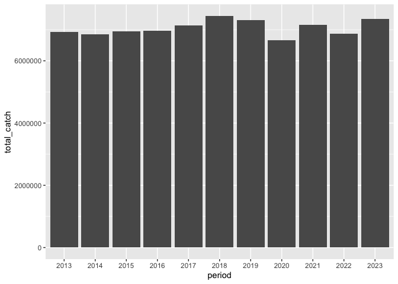

## Instructions
Answer the following questions and/or complete the exercises in RMarkdown. Please embed all of your code and push the final work to your repository. Your report should be organized, clean, and run free from errors. Remember, you must remove the `#` for any included code chunks to run.  

## Load the libraries

``` r
library("tidyverse")
library("janitor")
library("naniar")
options(scipen = 999)
```

## About the Data
For this assignment we are going to work with a data set from the [United Nations Food and Agriculture Organization](https://www.fao.org/fishery/en/collection/capture) on world fisheries. These data were downloaded and cleaned using the `fisheries_clean.Rmd` script.  

Load the data `fisheries_clean.csv` as a new object titled `fisheries_clean`.

``` r
fisheries_clean <- read_csv("data/fisheries_clean.csv")
```

1. Explore the data. What are the names of the variables, what are the dimensions, are there any NA's, what are the classes of the variables, etc.? You may use the functions that you prefer.

``` r
names(fisheries_clean)
```

```
## [1] "period"          "continent"       "geo_region"      "country"        
## [5] "scientific_name" "common_name"     "taxonomic_code"  "catch"          
## [9] "status"
```

``` r
summary(fisheries_clean)
```

```
##      period      continent          geo_region          country         
##  Min.   :1950   Length:1055015     Length:1055015     Length:1055015    
##  1st Qu.:1980   Class :character   Class :character   Class :character  
##  Median :1996   Mode  :character   Mode  :character   Mode  :character  
##  Mean   :1994                                                           
##  3rd Qu.:2010                                                           
##  Max.   :2023                                                           
##  scientific_name    common_name        taxonomic_code         catch           
##  Length:1055015     Length:1055015     Length:1055015     Min.   :       0.0  
##  Class :character   Class :character   Class :character   1st Qu.:       0.0  
##  Mode  :character   Mode  :character   Mode  :character   Median :       2.9  
##                                                           Mean   :    5089.9  
##                                                           3rd Qu.:     400.0  
##                                                           Max.   :12277000.0  
##     status         
##  Length:1055015    
##  Class :character  
##  Mode  :character  
##                    
##                    
## 
```

2. Convert the following variables to factors: `period`, `continent`, `geo_region`, `country`, `scientific_name`, `common_name`, `taxonomic_code`, and `status`.

``` r
fisheries_clean <- fisheries_clean %>% 
  mutate(across(c("period","continent","geo_region","country","scientific_name","common_name","taxonomic_code","status"),as.factor))
```

3. Are there any missing values in the data? If so, which variables contain missing values and how many are missing for each variable?

``` r
colSums(is.na(fisheries_clean))
```

```
##          period       continent      geo_region         country scientific_name 
##               0           23811           23811               0               0 
##     common_name  taxonomic_code           catch          status 
##            2846               0               0               0
```

``` r
miss_var_summary(fisheries_clean)
```

```
## # A tibble: 9 × 3
##   variable        n_miss pct_miss
##   <chr>            <int>    <num>
## 1 continent        23811    2.26 
## 2 geo_region       23811    2.26 
## 3 common_name       2846    0.270
## 4 period               0    0    
## 5 country              0    0    
## 6 scientific_name      0    0    
## 7 taxonomic_code       0    0    
## 8 catch                0    0    
## 9 status               0    0
```

4. How many countries are represented in the data?

``` r
nlevels(fisheries_clean$country)
```

```
## [1] 249
```

5. The variables `common_name` and `taxonomic_code` both refer to species. How many unique species are represented in the data based on each of these variables? Are the numbers the same or different?

``` r
nlevels(fisheries_clean$common_name)
```

```
## [1] 3389
```

``` r
nlevels(fisheries_clean$taxonomic_code)
```

```
## [1] 3722
```

6. In 2023, what were the top five countries that had the highest overall catch?

``` r
fisheries_clean %>% 
  filter(period == "2023") %>% 
  select(country,catch) %>% 
  group_by(country) %>% 
  summarise(total_catch = sum(catch,nam.rm=T)) %>% 
  arrange(desc(total_catch)) %>% 
  slice_head(n=5)
```

```
## # A tibble: 5 × 2
##   country                  total_catch
##   <fct>                          <dbl>
## 1 China                      13424706.
## 2 Indonesia                   7820834.
## 3 India                       6177986.
## 4 Russian Federation          5398033 
## 5 United States of America    4623695
```

7. In 2023, what were the top 10 most caught species? To keep things simple, assume `common_name` is sufficient to identify species. What does `NEI` stand for in some of the common names? How might this be concerning from a fisheries management perspective?

``` r
fisheries_clean %>% 
  filter(period == "2023") %>% 
  select(common_name,catch) %>% 
  group_by(common_name) %>% 
  summarise(total_catch = sum(catch,nam.rm=T)) %>% 
  arrange(desc(total_catch)) %>% 
  slice_head(n=5)  
```

```
## # A tibble: 5 × 2
##   common_name                    total_catch
##   <fct>                                <dbl>
## 1 Marine fishes NEI                 8553908.
## 2 Freshwater fishes NEI             5880105.
## 3 Alaska pollock(=Walleye poll.)    3543412.
## 4 Skipjack tuna                     2954737.
## 5 Anchoveta(=Peruvian anchovy)      2415710.
```

8. For the species that was caught the most above (not NEI), which country had the highest catch in 2023?

``` r
fisheries_clean %>% 
  filter(period == "2023" & common_name == "Alaska pollock(=Walleye poll.)") %>% 
  select(country,common_name,catch) %>% 
  group_by(country,common_name) %>% 
  summarise(total_catch = sum(catch,nam.rm=T)) %>% 
  arrange(desc(total_catch))
```

```
## `summarise()` has grouped output by 'country'. You can override using the
## `.groups` argument.
```

```
## # A tibble: 6 × 3
## # Groups:   country [6]
##   country                               common_name                  total_catch
##   <fct>                                 <fct>                              <dbl>
## 1 Russian Federation                    Alaska pollock(=Walleye pol…    1893925 
## 2 United States of America              Alaska pollock(=Walleye pol…    1433539 
## 3 Japan                                 Alaska pollock(=Walleye pol…     122901 
## 4 Democratic People's Republic of Korea Alaska pollock(=Walleye pol…      58731 
## 5 Republic of Korea                     Alaska pollock(=Walleye pol…      28433.
## 6 Canada                                Alaska pollock(=Walleye pol…       5888.
```

9. How has fishing of this species changed over the last decade (2013-2023)? Create a  plot showing total catch by year for this species.

``` r
fisheries_clean %>% 
  filter(period==c(as.character(2013:2023))) %>% 
  select(period,catch) %>% 
  group_by(period) %>% 
  summarise(total_catch = sum(catch,nam.rm=T)) %>% 
  ggplot(aes(x=period,y=total_catch))+
  geom_col()
```

```
## Warning: There were 2 warnings in `filter()`.
## The first warning was:
## ℹ In argument: `period == c(as.character(2013:2023))`.
## Caused by warning in `==.default`:
## ! longer object length is not a multiple of shorter object length
## ℹ Run `dplyr::last_dplyr_warnings()` to see the 1 remaining warning.
```

<!-- -->

10. Perform one exploratory analysis of your choice. Make sure to clearly state the question you are asking before writing any code.

What are the top 5 catched species in Asia from 2013 - 2023.

``` r
fisheries_clean %>% 
  filter(period==c(as.character(2013:2023))) %>% 
  filter(continent=="Asia") %>% 
  select(common_name,catch) %>% 
  group_by(common_name) %>% 
  summarise(total_catch = sum(catch,nam.rm=T)) %>% 
  arrange(desc(total_catch)) %>% 
  slice_head(n=5)    
```

```
## Warning: There were 2 warnings in `filter()`.
## The first warning was:
## ℹ In argument: `period == c(as.character(2013:2023))`.
## Caused by warning in `==.default`:
## ! longer object length is not a multiple of shorter object length
## ℹ Run `dplyr::last_dplyr_warnings()` to see the 1 remaining warning.
```

```
## # A tibble: 5 × 2
##   common_name       total_catch
##   <fct>                   <dbl>
## 1 Scads NEI            5434378.
## 2 Gazami crab          5334223 
## 3 Marine fishes NEI    4326294.
## 4 Yesso scallop        3406876 
## 5 Jellyfishes NEI      1973607.
```

## Knit and Upload
Please knit your work as an .html file and upload to Canvas. Homework is due before the start of the next lab. No late work is accepted. Make sure to use the formatting conventions of RMarkdown to make your report neat and clean!  
